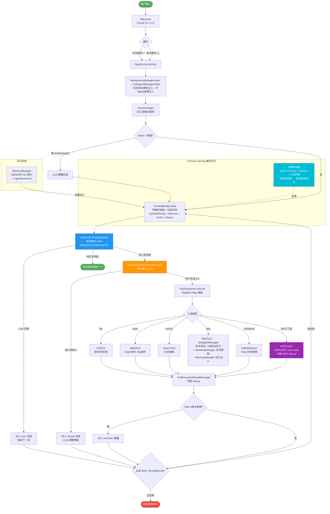

# MVP CLAUDE CODE — 纯 Java AI 编程助手

[](https://adoptium.net/)
[](https://maven.apache.org/)
[](LICENSE)

> **后端实习项目。** 用 2000 行纯 Java 从零实现类 Claude Code 的 AI Agent，深入理解 LLM 应用架构。
>
> 不依赖 Spring Boot。核心命题：Model 是司机（决定做什么），Harness 是车辆（决定能做什么）——后端工程师造的是车。

## 整体流程图



## 项目演示

```
> 请用 task 工具分别统计 pom.xml 依赖数和 src 目录 .java 文件数

📊 汇总结果
├── 📦 Maven 依赖数: 7
└── 📄 Java 源文件数: 25
```

## 项目特性

- **Token 预算制 + 熔断** — 不限轮次，限上下文水位。水位 <90% 继续，90-95% 压缩后继续，连续 3 次压不下来注入警告让 LLM 自主卸载，无视则硬终止
- **流式输出** — 同步 API 用于摘要，流式 API 用于主对话，CompletableFuture 桥接
- **并行工具执行** — LLM 一次返回的互不依赖工具调用，确认后 CompletableFuture 线程池并行执行
- **工具崩溃保护** — `catch(Throwable)` 兜底 OOM 等 Error，写 `[tool crash]` 进 history 让 LLM 换路，进程不崩
- **压缩失败降级** — LLM 摘要失败时不丢旧消息，退化为纯裁剪（保留后一半）；连续 3 次失败放弃压缩等熔断接手（对标 Claude Code）
- **四种 SubAgent 类型** — Explore（只读探索）/ Plan（方案设计）/ Verification（验证审查）/ General（通用），对标 Claude Code
- **SubAgent 异步并行** — SubagentManager 线程池 + 通知队列，只读类型（Explore/Plan/Verification）无限制并行，父 Agent 不阻塞
- **GENERAL Worktree 隔离** — WorktreeManager 为每个 GENERAL 子 Agent 创建独立 git worktree，文件系统级别物理隔离，多个可同时跑不冲突
- **SubAgent 记忆注入** — 子 Agent 可读取 MEMORY.md 获取项目上下文，只读不写
- **SubAgent 双层安全** — 第一道物理隔离（工具不在 Dispatch Map 里就调不了），第二道 Prompt 否定指令（NEVER/FORBIDDEN），Prompt 失效 ≠ 安全失效
- **FileTool ThreadLocal 隔离** — 支持线程级 workspace 覆写，子 Agent 在 worktree 中执行时文件操作自动指向正确目录
- **BashTool 只读白名单模式** — `new BashTool(true)` 只允许诊断类命令（java/mvn/git-status/ls/cat 等），VERIFICATION Agent 专用，第一道防线真正拦住破坏性写操作
- **SubAgent 容错增强** — 连续 LLM 失败超阈值（3次）提前退出并返回部分结果；最大轮次耗尽时保留已有中间输出而非丢弃；LLM 失败指数退避（1s→2s→4s）
- **工具执行确认** — 交互模式 y/n/a 三级确认，用户否决写回 history 让 LLM 调整策略
- **Prompt Caching 架构** — 可缓存前缀分离（System + Memory + Tools），跨请求复用，节省 30-50% token
- **手写 MCP 协议** — JSON-RPC over stdio，零 MCP SDK 依赖，面试能深讲 10 分钟
- **三层上下文压缩** — Micro（静默裁剪）→ Auto（LLM 摘要 + 失败降级）→ Manual（用户触发）
- **文件型记忆系统** — MEMORY.md 索引 + 四种类型，跨会话持久化，人可读
- **子 Agent 隔离** — 独立上下文 + 防递归，天然线程安全
- **Todo 追踪** — TodoWrite 工具 + 3 条硬约束（最多20条、仅1条in_progress、禁止批量completed）+ 3 轮 nag 提醒
- **后台异步任务** — BackgroundManager 线程池 + 通知队列，长时间任务不阻塞主循环
- **错误自愈** — LLM 异常 → `<error>` 注入上下文继续；工具崩溃 → `[tool crash]` 让 LLM 换路
- **MCP 生态接入** — 自动发现外部 MCP Server 工具（filesystem/github/postgres 等）
- **极简依赖** — 仅 7 个 Maven 依赖，无数据库，无 DI 容器

## 项目结构

```
mvp-claude-code/
├── 📁 src/main/java/com/agent/
│   ├── Main.java                       # 🎯 Picocli CLI 入口（-i 交互 / -p 单次）
│   │
│   ├── 📁 core/                        # 🔧 核心引擎
│   │   ├── AgentLoop.java              # while(true) 主循环（流式 + 确认 + 并行执行）
│   │   ├── AIService.java              # DeepSeek API 封装（双模：同步+流式）
│   │   ├── BackgroundManager.java      # 后台异步任务管理器（线程池+通知队列）
│   │   ├── CompactService.java         # 三层上下文压缩
│   │   ├── ContextBuilder.java         # ChatRequest 拼装 + Prompt Caching 前缀分离
│   │   ├── SubagentRunner.java         # 四种 SubAgent + 双层安全保障
│   │   ├── SubagentManager.java        # 异步子Agent管理（线程池 + Worktree + 通知队列）
│   │   ├── WorktreeManager.java        # Git worktree 管理（创建/清理/diff）
│   │   ├── ToolDispatcher.java         # Dispatch Map（黑名单/白名单过滤）
│   │   └── ToolExecutionConfirmation.java  # 工具执行确认（y/n/a 三级）
│   │
│   ├── 📁 tools/                       # 🔨 工具集合
│   │   ├── BaseTool.java               # 工具抽象基类
│   │   ├── BashTool.java               # Shell 命令执行
│   │   ├── BackgroundRunTool.java      # 后台任务启动工具
│   │   ├── CheckBackgroundTool.java    # 后台任务状态查询工具
│   │   ├── FileTool.java               # 文件读写（含 ~ 路径展开）
│   │   ├── SearchTool.java             # 文本搜索（支持 ext 过滤）
│   │   ├── TaskTool.java               # 子任务委托（四种 agent_type）
│   │   ├── TodoManager.java            # Todo 状态管理（内存）
│   │   ├── TodoWriteTool.java          # TodoWrite 工具（Claude Code 风格）
│   │   ├── ToolRegistry.java           # 工具注册表（ToolSpecification 管理）
│   │   ├── ToolResult.java             # 工具执行返回值
│   │   └── 📁 mcp/                     # 🔌 MCP 协议实现
│   │       ├── MCPClient.java          # JSON-RPC over stdio 客户端
│   │       └── MCPToolAdapter.java     # MCP 工具 → BaseTool 适配
│   │
│   ├── 📁 memory/                      # 💾 记忆系统
│   │   ├── MemoryItem.java             # 记忆项数据结构
│   │   └── MemoryManager.java          # MEMORY.md 索引 + 四种类型文件
│   │
│   └── 📁 config/                      # ⚙️ 配置管理
│       └── AppConfig.java              # SnakeYAML 配置加载 + 环境变量插值
│
├── 📁 docs/
│   └── HARNESS_DESIGN.md               # 📖 设计思路 + 面试话术 + 踩坑记录
│
├── ⚙️ config.yaml.example              # 配置模板（可提交）
├── 📜 pom.xml                          # Maven 配置
├── 📖 README.md                        # 项目说明
└── 🙈 .gitignore                       # 排除 target/ config.yaml .agent/
```

## 模块说明

### `core/` — 核心引擎

**AgentLoop.java** — 永不改动的循环（流式 + 确认 + 并行 + Token 预算）

while(true) 是所有功能的底盘。每轮迭代：microCompact → autoCompact → 流式 LLM 调用（异常不崩溃）→ 工具确认（y/n/a，串行）→ 工具执行（CompletableFuture 线程池并行）→ Todo nag → **Token 预算检查** → 循环。

**Token 预算三级熔断（对标 Claude Code）：**
1. 水位 < 90% → 安全，继续
2. 水位 90-95% → 触发 compact 压缩，有效继续，无效 failureCount+1
3. 连续 3 次压缩无效 → 熔断，提示"用 task 拆分任务"

```yaml
# config.yaml 可配
context:
  maxRounds: 0           # 0=不限轮次，靠 token 预算
  maxContextTokens: 128000
  contextDangerRatio: 0.9
```

**AIService.java** — AI 服务封装（双模）

基于 LangChain4j，提供两种 API：
- `ChatLanguageModel`（同步）— 用于 CompactService 摘要压缩，无需流式
- `StreamingChatLanguageModel`（异步）— 用于 AgentLoop 主对话，`CompletableFuture<AiMessage>` 桥接 async → sync

```java
CompletableFuture<AiMessage> future = ai.streamingChat(messages, toolSpecs,
    token -> System.out.print(token));  // 实时流式打印
AiMessage aiMsg = future.get();          // 阻塞等待，拿到含工具调用的完整响应
```

设计要点：手写 `StreamingResponseHandler` 而不是用 `AiServices` 自动流式代理——我们需要控制 onNext（打印 token）、onComplete（拿工具调用）、onError（注入上下文）的每一步。

**ToolExecutionConfirmation.java** — 工具执行确认

交互模式 y/n/a 三级确认。y 执行本次、n 跳过本次并写入 history 让 LLM 调整策略、a 后续全部批准。单次模式（-p）自动批准所有工具。

**CompactService.java** — 三层上下文压缩 + 失败降级

| 层 | 触发 | 策略 | API 成本 | 失败降级 |
|---|------|------|---------|---------|
| Micro | 每轮 | 旧工具输出 > 2000 字符 → 截到 500 + 标记 | 零 | 无（纯字符串操作，不失败） |
| Auto | token > 阈值 | LLM 摘要旧消息 + 保留最近 10 轮 | 一次 LLM 调用 | 裁剪前一半旧消息保留后一半；连续 3 次失败放弃压缩等熔断 |
| Manual | `/compact` | 全量压缩 | 一次 LLM 调用 | 同 Auto |

**摘要失败不丢数据（对标 Claude Code）：** LLM 摘要 API 报错时，不会把旧消息全替换成"摘要生成失败"。第 1-2 次失败降级为纯裁剪（扔前一半留后一半），第 3 次放弃压缩原样返回等 Token 预算熔断接手。**用户消息在微裁剪中永远不受影响。**

**ContextBuilder.java** — 请求拼装 + Prompt Caching（对标 Claude Code 6 层架构）

每次 LLM 调用前组装完整 `ChatRequest`。三层结构，对标 Claude Code 泄露的 `<|cache_boundary|>` 分隔：

```
一次 API 请求 = messages + toolSpecifications

messages:
  ┌─ 缓存前缀（构造时固定，不复算）──────────────────┐
  │  System Prompt（角色 + 规则 + TodoWrite 规范）  │ ← DeepSeek 自动前缀匹配缓存
  └──────────────────────────────────────────────┘
  ┌─ 动态层（每次 build() 刷新）───────────────────┐
  │  工具名列表（ToolRegistry.describeNames()）     │ ← MCP 增删工具自动反映
  │  Memory 索引（MemoryManager.getIndex()）        │ ← 新记忆不丢失
  └──────────────────────────────────────────────┘
  ┌─ 对话历史 ──────────────────────────────────┐
  │  用户消息 + AI 回复 + 工具结果                │ ← 每轮追加

toolSpecifications:
  ┌─ 所有工具的 JSON Schema ────────────────────┐
  │  [{bash schema}, {file schema}, {mcp schema}]│ ← DeepSeek 自动缓存（结构化参数）
  └──────────────────────────────────────────────┘
```

**三点对齐 Claude Code：**
1. **不变的东西进缓存前缀**：System Prompt 单独缓存，命中率接近 100%
2. **会变的东西放动态层**：工具名列表 + Memory 每次从 ToolRegistry/MemoryManager 实时拿——MCP 中途增删工具、Agent 存新记忆立刻反映
3. **Schema 不占文本空间**：走 `toolSpecifications` 参数，跟 messages 隔离，DeepSeek 单独缓存

**SubagentRunner.java** — 四种专用子 Agent + 双层安全 + 记忆注入

四种类型对标 Claude Code 泄露架构。第一道防线：物理隔离（工具不在 Dispatch Map 里就调不了）；第二道防线：Prompt 否定指令（NEVER/FORBIDDEN）。Prompt 失效 ≠ 安全失效。子 Agent 可读取 MEMORY.md（只读不写），获取项目上下文。

| 类型 | 可用工具 | 移除 | 防线模式 | 记忆 |
|------|---------|------|---------|------|
| EXPLORE | file, search | bash, write, task, TodoWrite | 黑名单 | 可读 |
| PLAN | file, search | 其他全部 | **白名单（最严）** | 可读 |
| VERIFICATION | file, search, bash | write, task, TodoWrite | 黑名单 | 可读 |
| GENERAL | 除 task 外全有 | task | 黑名单 | 可读 |

**SubagentManager.java** — 异步子 Agent 管理器

4 线程固定池，`submit()` 提交后立刻返回任务 ID。只读类型（Explore/Plan/Verification）无限制并行。GENERAL 类型通过 WorktreeManager 创建独立 git worktree，文件系统级别物理隔离。完成后 `drain()` 把结果注入父 Agent 对话。FileTool ThreadLocal workspace 覆写确保子 Agent 文件操作指向正确目录。

**WorktreeManager.java** — Git worktree 管理器

`create()` 调用 `git worktree add --detach` 创建临时项目副本，`getDiff()` 获取子 Agent 修改内容，`remove()` 清理。为每个 GENERAL 子 Agent 提供文件系统级隔离。

**ToolDispatcher.java** — Dispatch Map

`Map<String, BaseTool>` 查表执行。支持 `without(name...)` 黑名单和 `only(name...)` 白名单两种过滤模式，运行时动态注册/注销（MCP 工具）。白名单模式用于 Plan Agent（只留 file+search，其他全部砍掉）。

**BackgroundManager.java** — 后台异步任务管理器

线程池执行长时间命令（编译、大型搜索），通知队列异步返回结果。AgentLoop 每轮 `drain()` 通知队列，自动注入 `<background-results>` 到上下文，不阻塞主循环。

### `tools/` — 工具集合

**FileTool** — 文件操作（read/write/list/exists），含 `~` 路径展开和 50K 输出截断

**BashTool** — Shell 命令执行，30 秒超时，输出自动截断

**SearchTool** — 文本搜索，支持 pattern + ext 过滤，最多 50 条结果

**TaskTool** — 子任务委托，异步提交到 SubagentManager 线程池。参数：prompt + agent_type(explore/plan/verification/general) + maxRounds。调用后立即返回"已启动"，子 Agent 后台执行，完成后结果通过 drain 自动注入对话

**BackgroundRunTool** — 启动后台任务，立即返回任务 ID，不阻塞 Agent 循环。适用于编译等耗时操作

**CheckBackgroundTool** — 查询后台任务状态，支持查询单个（taskId）或全部任务

**TodoWriteTool** — Claude Code 风格 Todo 管理，嵌套 JSON Schema（items 数组）

**TodoManager** — Todo 状态管理（内存），`hasOpenItems()` 供 AgentLoop nag 检测

**ToolRegistry** — 工具注册表，管理 `List<ToolSpecification>` + `Map<String, BaseTool>`，`without()` 副本用于子 Agent

**ToolResult** — 统一工具返回值，空文本防护

### `mcp/` — MCP 协议

**MCPClient.java** — 标准 JSON-RPC 2.0 客户端，通过子进程 stdio 通信。支持 initialize → tools/list → tools/call 完整握手流程。使用 `java.util.concurrent.atomic` 管理请求 ID。

**MCPToolAdapter.java** — MCP Server 的 `inputSchema` → LangChain4j `JsonObjectSchema` 转换。按类型动态构建 properties（string/integer/boolean/array）。

### `memory/` — 记忆系统

**MemoryManager.java** — 按项目隔离的文件型记忆。`global/` 存 USER/REFERENCE/FEEDBACK（跟人不跟项目），`projects/<项目名>/` 存 PROJECT（项目专属）。parseIndex() 正则解析 → `List<MemoryItem>`，save/delete 按类型路由到对应目录。索引全量注入 System Prompt，具体文件按需加载。

**MemoryItem.java** — 记忆项 DTO，name/type/description/fileName 四个字段 + toString() 序列化为索引行。MemoryManager 内部全程用 MemoryItem 对象操作，不再手动拼字符串。

### `config/` — 配置管理

**AppConfig.java** — SnakeYAML 解析 `config.yaml`。支持 `${ENV_VAR}` 环境变量插值。优先文件系统 → fallback classpath。

## 配置说明

### config.yaml

```yaml
model:
  provider: deepseek
  name: deepseek-chat
  baseUrl: https://api.deepseek.com/v1
  apiKey: ${DEEPSEEK_API_KEY}        # 环境变量，不要硬编码
  temperature: 0.7
  maxTokens: 4096

tools:
  builtin: [file, bash, search]
  mcp:
    enabled: false                     # 设为 true 启用 MCP
    servers:
      - name: filesystem
        command: npx                   # Windows 需全路径如 D:\Node.js\npx.cmd
        args: ["-y", "@modelcontextprotocol/server-filesystem", "."]

context:
  compactThreshold: 50000              # token 阈值，触发 auto compact
  maxRounds: 0                         # 最大轮次：0=不限（靠 token 预算），>0=轮次上限
  maxContextTokens: 128000             # 上下文窗口大小
  contextDangerRatio: 0.9              # 水位达 90% 触发压缩，95% 熔断

memory:
  dir: ~/.agent/memory                 # 记忆文件存储目录

security:
  workspace: ""                        # 留空=当前目录；填绝对路径=限制文件操作范围
```

## 快速开始

### 环境要求

- Java 17+
- Maven 3.6+
- DeepSeek API Key（[申请地址](https://platform.deepseek.com/)）
- （可选）Node.js 16+ 用于 MCP 工具

### 安装运行

```bash
# 1. 克隆
git clone https://github.com/cookie250825/mvp-claude-code.git
cd mvp-claude-code

# 2. 配置 API Key
cp config.yaml.example config.yaml
export DEEPSEEK_API_KEY="你的key"

# 3. 构建
mvn package -DskipTests

# 4. 交互模式
java -Dfile.encoding=UTF-8 -jar target/mvp-claude-code-1.0-SNAPSHOT.jar -i

# 5. 单次提问
java -Dfile.encoding=UTF-8 -jar target/mvp-claude-code-1.0-SNAPSHOT.jar -p "帮我读 pom.xml"
```

### 交互命令

| 命令 | 功能 |
|------|------|
| `/compact` | 手动触发上下文压缩 |
| `/memory` | 查看当前记忆索引 |
| `/quit` | 退出 |

### MCP 使用

1. 编辑 `config.yaml`，设置 `tools.mcp.enabled: true`
2. 配置 MCP 服务器（command + args）
3. 启动 Agent，MCP 工具自动发现并注册

```yaml
mcp:
  enabled: true
  servers:
    - name: filesystem
      command: npx
      args: ["-y", "@modelcontextprotocol/server-filesystem", "."]
```

## 技术栈

| 组件 | 技术 | 说明 |
|------|------|------|
| AI 框架 | LangChain4j 0.36.2 | Function Calling + 流式 |
| CLI | Picocli 4.7.5 | 注解式命令行解析 |
| JSON | Jackson 2.16.1 | 序列化 + MCP 协议解析 |
| 配置 | SnakeYAML 2.2 | YAML 配置加载 |
| HTTP | LangChain4j 内置 | 通过 OpenAiChatModel 封装 |
| MCP | 手写 JSON-RPC | ProcessBuilder + stdio 通信 |
| 日志 | SLF4J 2.0.9 + Logback | 标准日志门面 |
| 构建 | Maven + shade 插件 | Fat JAR 打包 |

**不引入：Spring Boot、JLine、任何数据库。**

## 核心设计决策 — 我们为什么这么做

> 参照：[learn-claude-code](https://github.com/shareAI-lab/learn-claude-code)（Python 参考实现，Anthropic 官方教程）

---

### AgentLoop：为什么不用 AiServices 自动代理

| 项目 | 做法 |
|------|------|
| learn-claude-code | Python 手写 `while True` |
| **我们** | **手写 `while(true)` + 手动 Dispatch Map** |

- **理由：** `AiServices` 是黑盒——工具怎么调用、何时重试、异常怎么处理，全在框架内部。手写循环让我们控制每一步：micro compact 在 LLM 调用前执行、异常包装成 `<error>` 注入上下文继续、工具结果超 2000 字符自动截断。`AiServices` 做不到这种粒度。
- **代价：** 多了约 200 行样板代码。但面试能讲清楚"while(true) 里每一步为什么放在这个位置"——这是理解 Agent 的标志。

---

### ToolDispatcher：为什么不用 @Tool 注解反射

| 项目 | 做法 |
|------|------|
| learn-claude-code | `Map<String, Function>` 函数字典 |
| LangChain4j 常规 | `@Tool` 注解 + `AiServices` 反射代理 |
| **我们** | **抽象类 `BaseTool` + Dispatch Map** |

- **理由：** MCP 工具是运行时从外部服务器下发的，不可能提前写 `@Tool` 注解。Dispatch Map 支持运行时 `register()`/`unregister()`。`withoutTaskTool()` 一行代码创建不含 "task" 的 Map 副本实现子 Agent 防递归——注解反射做不到这种运行时裁剪。

---

### CompactService：三层压缩，每层细节不同

learn-claude-code 也是三层（micro/auto/manual），但每层的策略和我们不一样：

**Micro 层对比：**

| 细节 | learn-claude-code | 我们 |
|------|------------------|------|
| 触发 | 每轮 | 每轮 |
| 策略 | 替换为占位符 `[Previous: used {tool_name}]` | 截断到 500 字符 + 标记 |
| 保留条数 | 最近 3 条 | 最近 10 条 |
| 保护规则 | `read_file` 结果永不裁剪 | 无特殊保护 |
| 最小阈值 | 内容 > 100 字符才处理 | 内容 > 2000 字符才处理 |

**Auto 层对比：**

| 细节 | learn-claude-code | 我们 |
|------|------------------|------|
| 触发 | token 估算 > 50K | token 估算 > 配置阈值 |
| 摘要后 | **全量替换** — 只剩 1 条摘要消息 | 保留最近 10 条 + 摘要 |
| 转录格式 | JSONL | 纯文本 |
| 保存时机 | 压缩前落盘 | 压缩前落盘 |

**Manual 层对比：**

| 细节 | learn-claude-code | 我们 |
|------|------------------|------|
| 触发者 | **模型调 `compact` 工具** | 用户终端敲 `/compact` |
| 执行后 | 返回 `agent_loop`，结束本次对话 | 压缩 history，继续对话 |

**为什么我们保持 KEEP_RECENT=10 而不是 learn-cc 的 3？** learn-cc 替换成占位符，3 条足够保证上下文连贯。我们做截断保留部分内容，需要 10 条来让 LLM 看到更多上下文的碎片。

**为什么我们没有 PRESERVE_RESULT_TOOLS？** 因为我们用截断而非占位符——截断后的内容仍可读，不需要保护 `read_file`。

---

### MemoryManager：为什么用 Markdown 文件而不是数据库

| 项目 | 做法 |
|------|------|
| learn-claude-code | ❌ **无独立语义记忆** — 只有转录落盘（S06）+ 任务 JSON（S07）+ 团队配置（S09） |
| **我们** | **MEMORY.md 索引 + 四种类型文件** — 自研，灵感来自 Claude Code 产品行为 |

- **理由：** Markdown 文件人可读、Git 友好、零依赖。四种类型（user/feedback/project/reference）让 MEMORY.md 索引可读。
- **二层模式：** 索引全量注入 System Prompt（轻量），Agent 需要时用 FileTool 读取具体文件（按需）。
- **本质区别：** learn-claude-code 记的是"发生过什么"（操作记录）。我们记的是"应该记住什么"（语义记忆）。

---

### MCPClient：为什么手写而不用 MCP SDK

| 项目 | 做法 |
|------|------|
| learn-claude-code | ❌ 不含 MCP |
| **我们** | **纯 Java 标准库实现 JSON-RPC over stdio** |

- **理由：** 手写的过程就是理解协议的过程——JSON-RPC 握手（initialize → initialized）、tools/list 解析、tools/call 参数适配——面试能讲 10 分钟。不依赖任何 MCP SDK。
- **遇过的坑：** Windows 下 `ProcessBuilder` 找不到 `npx`（Bash PATH ≠ Windows PATH），需全路径。`readResponse()` 每行读一次，MCP Server 发多行 JSON 会损坏——已知限制，面试讲 trade-off 的好素材。

---

### SubagentRunner：四种专用类型 + 双层安全保障（对标 Claude Code）

| 项目 | 做法 |
|------|------|
| learn-claude-code (s_full) | `agent_type` 区分工具集（Explore 默认只给 bash+read；非 Explore 给全部） |
| **我们** | **四种专用类型（EXPLORE/PLAN/VERIFICATION/GENERAL）+ 双层安全** |

- **四种类型：** 每个类型有不同的工具集安全边界——EXPLORE 黑名单去 bash/write，PLAN 白名单仅 file+search（最严），VERIFICATION 可跑只读诊断，GENERAL 除 task 外全有。
- **双层安全：** 第一道物理隔离（工具不在 Dispatch Map 里就调不了）；第二道 Prompt 否定指令（NEVER/FORBIDDEN）。Prompt 失效 ≠ 安全失效——第一道防线不依赖 LLM 听话。
- **防递归：** 所有类型都物理移除 task 工具——在能力层截断，不是执行层拦截。

### SubagentManager：异步并行 + Worktree 隔离（对标 Claude Code）

| 项目 | 做法 |
|------|------|
| learn-claude-code | 子 Agent 异步并行执行，同一轮可启动多个 |
| **我们** | **SubagentManager 线程池 + WorktreeManager 文件隔离** |

- **异步非阻塞：** task() 调用后立即返回"已启动"，子 Agent 在后台线程执行。父 Agent 不受阻塞，可继续工作或启动更多子 Agent。完成后结果通过 drain() 自动注入。
- **只读并行：** Explore/Plan/Verification 无限制并行——纯读操作不存在冲突。
- **GENERAL Worktree 隔离：** 每个 GENERAL 子 Agent 获得独立的 `git worktree add --detach` 临时副本。改同一个文件也不互相覆盖。完成后 git diff 附加到结果中，父 Agent 决定是否合入。
- **线程安全：** SubagentRunner 全局部变量、AIService 无状态、ToolDispatcher/Registry 每次 clone、FileTool ThreadLocal workspace 覆写——无需任何锁。
- **记忆注入：** 子 Agent 通过 MemoryManager 读取 MEMORY.md，获取项目上下文。只读不写——子 Agent 是一次性工人。

---

### 与 learn-claude-code 的核心差异总结

| 设计点 | learn-claude-code | 我们的选择 | 为什么不同 |
|--------|------------------|-----------|-----------|
| 语言 | Python | Java 17 | 静态类型适合面试讲"架构" |
| AI 框架 | 手写 HTTP | LangChain4j 封装 | 框架处理 API 细节，聚焦 Harness |
| API 协议 | Anthropic Native | OpenAI 兼容（DeepSeek） | 国内更便宜、更稳定 |
| 工具定义 | 函数字典 | 抽象类 + Dispatch Map | 类型安全 + 运行时动态注册 |
| 压缩策略 | 三层（Micro 占位符 / Auto 全量替换 / Manual 模型触发） | 三层（Micro 截断 / Auto 保留 10 条 / Manual 用户命令） | 同是三层，每层策略不同 |
| 记忆系统 | ❌ 无（仅转录 + 任务） | MEMORY.md + 四种类型 | 自研，灵感来自 Claude Code 产品 |
| Teammate | ❌ | ❌ | 偏离定位，面试讲不清 |
| Todo 提醒 | ✅ 3 轮 nag | ✅ 同样实现 + 3 条硬约束 | Claude Code 真实行为 |
| 流式输出 | ❌（同步阻塞调用） | **✅ CompletableFuture 桥接 async→sync** | 用户体验底线 |
| 工具确认 | ❌ | **✅ y/n/a 三级确认** | 安全防线 |
| 并行工具执行 | ❌ | **✅ CompletableFuture 线程池** | 减少 API 调用轮次 |
| Prompt Caching | ❌ | **✅ 前缀分离架构** | 结构自带缓存，面试加分 |
| SubAgent 类型 | 1 种（Explore） | **✅ 4 种（Explore/Plan/Verification/General）** | 对标 Claude Code 泄露架构 |
| SubAgent 并发 | ❌ 同步 | **✅ 异步并行 + Worktree 隔离** | 对标 Claude Code 子Agent |
| SubAgent 安全 | 工具层去 task | **✅ 双层（物理隔离 + Prompt NEVER）** | Prompt 失效 ≠ 安全失效 |
| 会话管理 | ❌（无持久化会话） | ❌ | MVP 阶段不需要 |

## 面试高频问题与回答

> 这是面试时最常被问到的问题，以下是建议回答思路（讲给面试官听的口语版）。

---

### Q1：这个项目和 Claude Code 有什么区别，你学到了什么？

**答：** 核心架构是对标的——都是 while(true) Agent 循环、Token 水位制熔断、三层上下文压缩、四种 SubAgent 类型、Git Worktree 文件隔离、MEMORY.md 记忆系统。整体相似度在 70% 左右。差距主要在企业级功能：没有会话持久化、没有多用户隔离、没有实时协作——这些是我有意省掉的，MVP 阶段不需要。

学到最多的是**"Harness Engineering"这个思维模型**：后端工程师不是在造司机（LLM），而是在造车（执行环境）。车决定司机能做什么，车的安全设计决定系统的上限。这让我对 Agent 架构从"调 API"升级到"约束 + 资源管理 + 安全边界"的系统性视角。

---

### Q2：Token 预算制是怎么工作的，为什么不用轮次限制？

**答：** 轮次限制太粗糙——短任务可能 5 轮就完，长任务可能需要 50 轮，一刀切没有意义。我用的是水位制：实时估算当前对话历史的 token 数，除以模型的上下文窗口大小（128K），得到一个比例。

三级熔断：低于 90% 正常跑，90-95% 触发压缩，连续 3 次压缩都没压下来就注入警告给 LLM 最后一轮机会——让它自己决定是调 task 工具卸载子任务还是直接返回结果，无视警告就硬终止。

这个设计让 LLM 在接近容量时能自主收尾，而不是突然被截断，体验更接近人类助手说"我快处理不了了，要不要先拆成小块"。

---

### Q3：SubAgent 双层安全是怎么设计的？为什么要两道防线？

**答：** 第一道是**物理工具白名单**——PLAN 类型的子 Agent，工具 Dispatch Map 里根本就没有 bash、write、task，调用这些工具直接报"Unknown tool"，LLM 没有任何绕过的可能。

第二道是**Prompt 否定指令**——System Prompt 里写 `FORBIDDEN: 任何执行操作，不写文件，不跑命令`。

为什么需要两道？因为 Prompt 可以被越狱——攻击者可以通过注入指令、角色扮演等方式让 LLM 忽视 FORBIDDEN。但忽视了也没用，因为工具物理上不存在。两道防线互为备份，任意一道失效另一道还在。这种纵深防御在互联网 LLM 应用里很少见，大多数系统只靠 Prompt 层。

---

### Q4：Prompt Caching 怎么实现的，能节省多少成本？

**答：** 核心思路是**让每次请求的前段字节序列不变**，API 网关就能命中缓存。我把消息列表分三层：最前面是 System Prompt（角色设定、安全规则），这是同一个 List 对象引用，字节完全不变；中间是动态层（工具名列表 + Memory 索引），每轮可能变化；最后是对话历史。

DeepSeek 和 Anthropic 的 API 都支持前缀缓存：只要请求头部的消息序列跟上一次一样，就命中缓存，不重新计算 token。System Prompt 通常几千 token，每次请求都能省掉这部分，理论上节省 30-50%。

---

### Q5：Git Worktree 为什么能解决并发冲突？

**答：** 普通的文件操作隔离是在内存里设沙箱边界，但两个线程如果操作同一个物理文件还是会冲突。Git Worktree 是 git 的原生功能，`git worktree add --detach` 创建的是一个独立的工作目录——相当于在文件系统层面克隆了一个项目副本，但共享 git 历史，不占双倍磁盘。

每个 GENERAL 子 Agent 启动时我分配一个独立的 worktree 目录，通过 ThreadLocal 覆写 FileTool 的 workspace 根路径，子 Agent 的所有文件操作都指向它自己的目录，物理上不可能冲突。完成后用 `git diff` 获取它的变更，父 Agent 决定是否合入主工作区。

---

### Q6：为什么手写 MCP 协议而不用 SDK？

**答：** 两个原因。第一是**理解深度**：MCP 协议是 JSON-RPC 2.0 over stdio，握手流程是 initialize → notifications/initialized → tools/list → tools/call，为什么需要 initialized 通知、为什么用 stdio 不用 HTTP、工具参数怎么通过 inputSchema 协商——手写一遍这些都清楚了，调 SDK 学不到。第二是**零依赖**：不引入额外 jar，Fat JAR 更小，部署更干净。

面试能聊的坑也挺多：Windows 下 ProcessBuilder 找不到 npx（Bash PATH 和 Windows PATH 不一样，需要写全路径）、readResponse 单行读取遇到多行 JSON 会损坏（已知限制，是 P0 修复项）。

---

### Q7：如果要支持 100 个并发用户怎么扩展？

**答：** 现在是单进程内存型，扩展路径很清晰：

1. **会话持久化**：conversation history 落 SQLite 或 Redis，每个用户 Session ID 隔离
2. **Agent 实例化**：每个请求创建独立的 AgentLoop + ContextBuilder 实例，共享 AIService（无状态）
3. **工具执行池化**：现在线程池是全局 4 线程，改为每用户独立池或全局大池 + 信号量限流
4. **水平扩容**：Agent 无状态化后，Session 路由到任意实例，负载均衡层分发
5. **MCP Server 复用**：MCPClient 现在每个 Agent 启一个子进程，100 用户就是 100 个进程，可以改为 MCP Server 进程池复用

---

### Q8：这个项目跟 Spring Boot 微服务项目有什么本质区别，对你有什么独特价值？

**答：** Spring 项目锻炼的是**框架使用能力**——如何配 Bean、如何写 Controller、如何整合中间件。这个项目锻炼的是**系统设计能力**——如何设计资源边界、如何在不确定性（LLM 输出不可预期）中保持系统稳定、如何通过架构约束来保证安全性。

对面试的独特价值是：Agent 架构、LLM 资源管理、并发安全设计、安全隔离这几个话题，在简历里很少见，面试官问起来我能展开讲 20-30 分钟，而不是千人一面的 CRUD + Redis + MQ。

---

## 为什么你应该关注这个项目

- 想理解 **Agent 循环的本质** → 看 `core/AgentLoop.java`（100 行）
- 想理解 **流式输出怎么实现** → 看 `core/AIService.java`（70 行）
- 想理解 **MCP 协议怎么实现** → 看 `tools/mcp/MCPClient.java`（150 行）
- 想理解 **上下文压缩怎么做** → 看 `core/CompactService.java`（110 行）
- 想理解 **Prompt Caching 怎么架构化** → 看 `core/ContextBuilder.java`（105 行）
- 想理解 **AI 记忆系统怎么设计** → 看 `memory/MemoryManager.java`（140 行）+ `MemoryItem.java`（46 行）
- 想理解 **子 Agent 怎么异步并行** → 看 `core/SubagentManager.java`（130 行）
- 想理解 **子 Agent 怎么隔离** → 看 `core/SubagentRunner.java`（85 行）
- 想理解 **Git worktree 怎么用于 Agent** → 看 `core/WorktreeManager.java`（70 行）
- 想理解 **工具确认怎么实现** → 看 `core/ToolExecutionConfirmation.java`（50 行）
- 想理解 **完整设计哲学** → 看 `docs/HARNESS_DESIGN.md`（11 章）

## 设计哲学

**Harness Engineering** — Agent = Model（司机）+ Harness（车辆）。你不造司机，你造车。

- 代码只定义工具权限，不定义执行流程 — 模型自己规划步骤
- 循环永远不变 — while(true) 是所有功能的底盘
- MVP 优先 — 先做面试能深讲 10 分钟的亮点，不做 UI 花活

详见 [`docs/HARNESS_DESIGN.md`](docs/HARNESS_DESIGN.md)

## 致谢

本项目深受以下项目启发：

- **[learn-claude-code](https://github.com/shareAI-lab/learn-claude-code)** — Anthropic 官方教程。Harness Engineering 范式、三层压缩、TodoWrite、Subagent 等核心概念均源于此。
- **[ThoughtCoding](https://github.com/zengxinyueooo/ThoughtCoding)** — 优秀的 Java + LangChain4j 实现。MCP 客户端设计、工具适配模式、项目工程化结构提供了重要参考。

站在巨人的肩膀上。

## 许可证

MIT License

## 贡献

欢迎提交 Issue 和 Pull Request。
